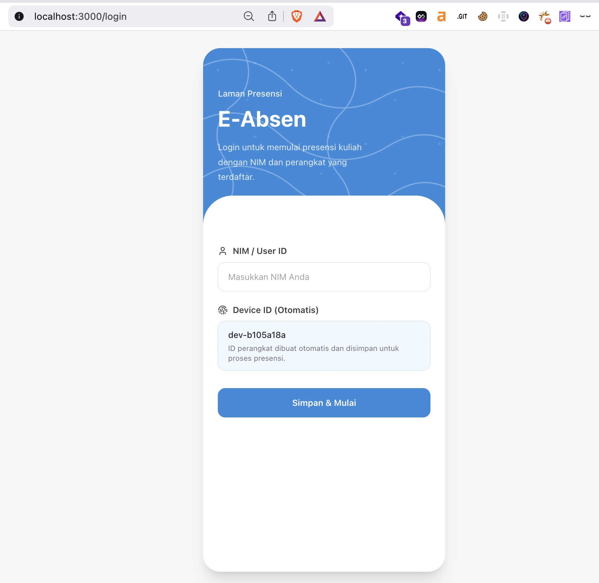
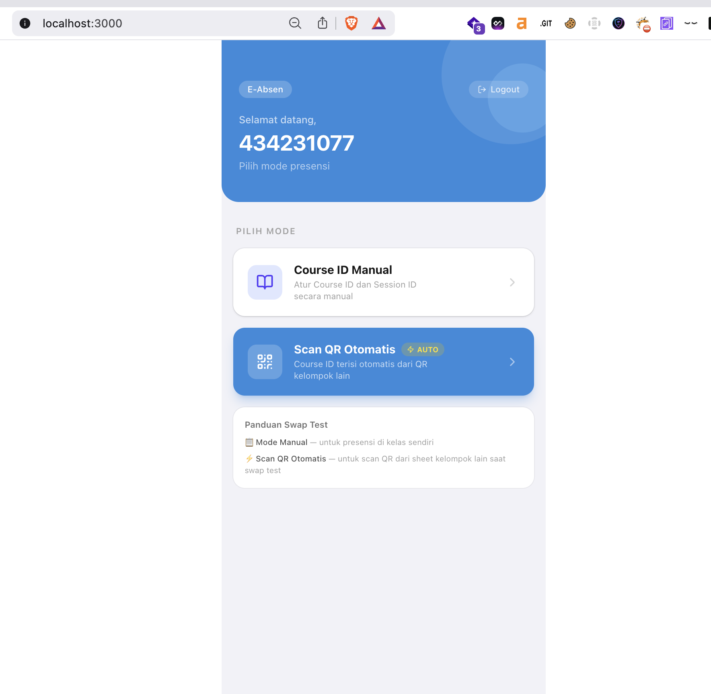
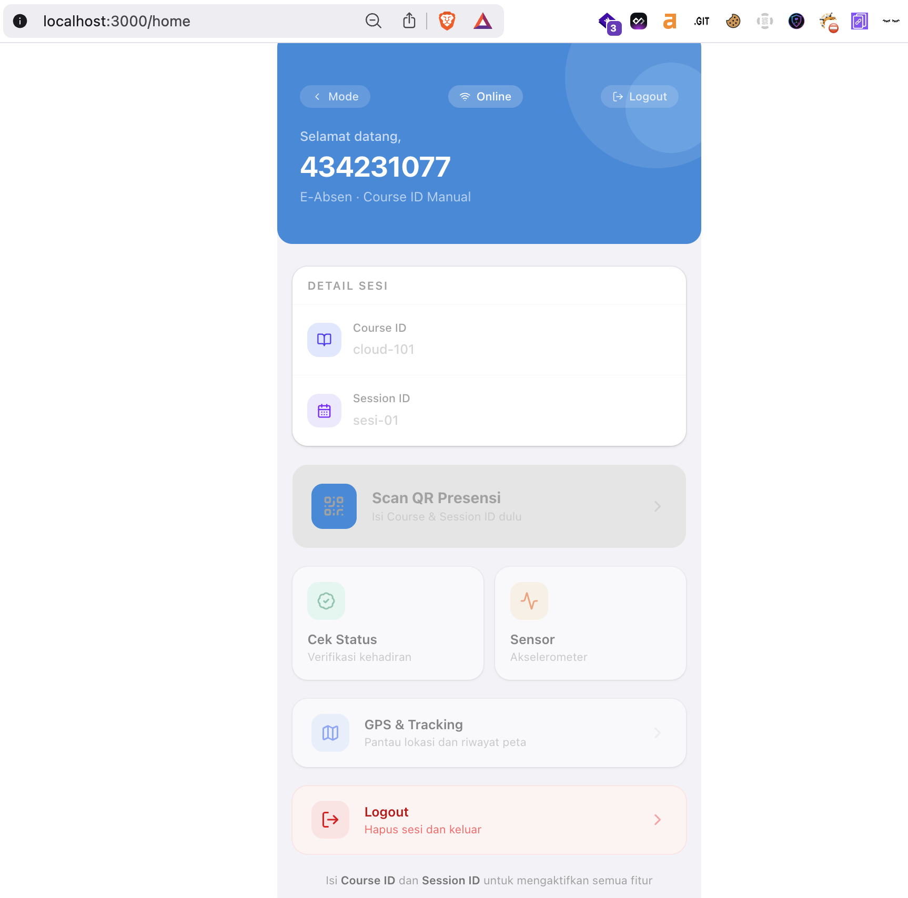
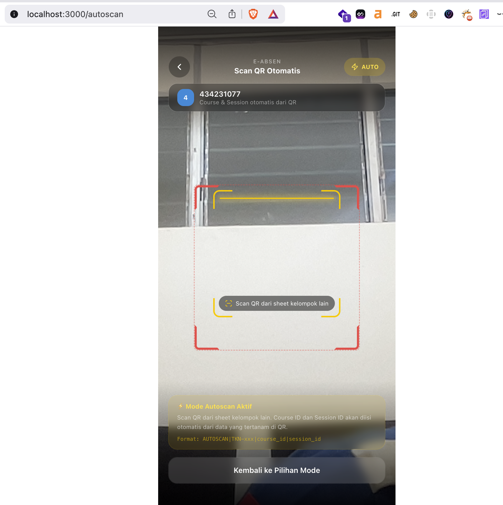
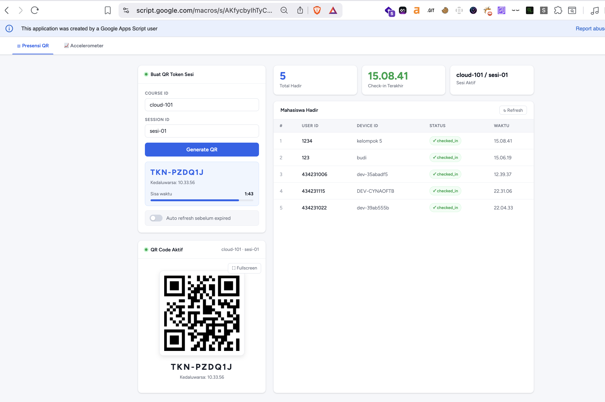
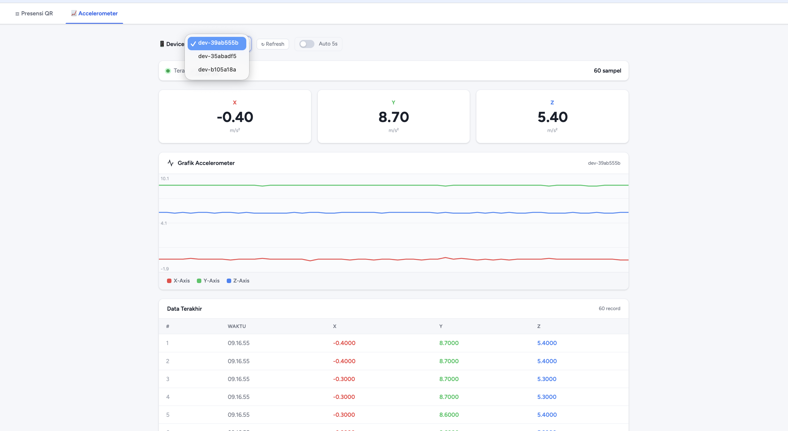
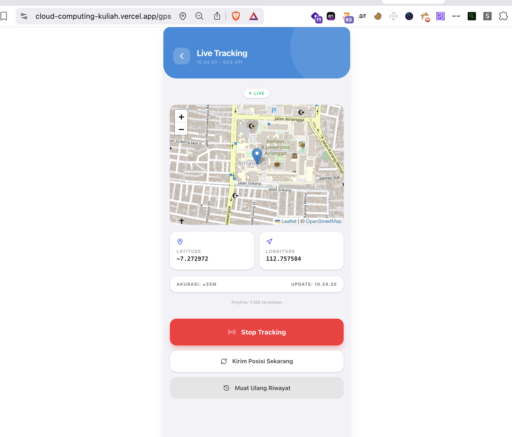
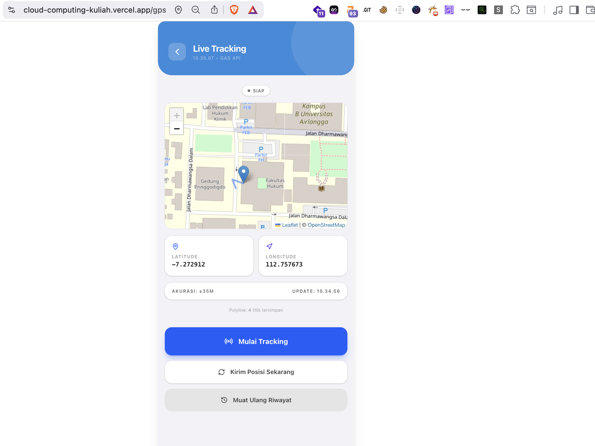
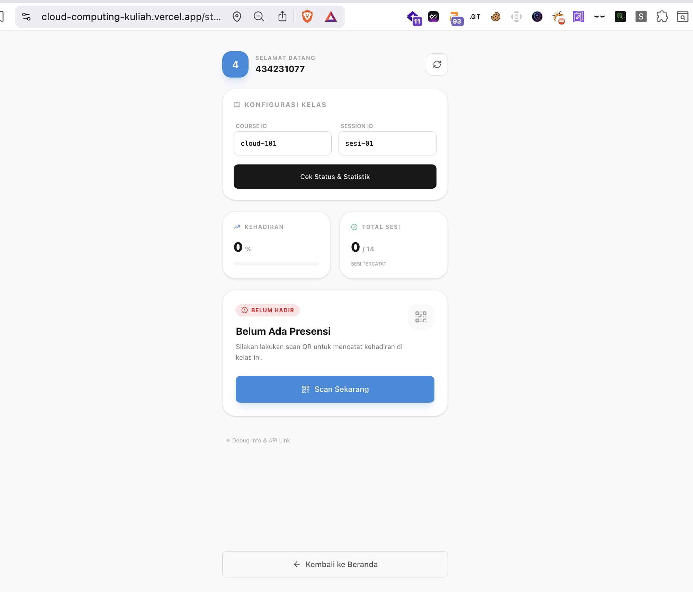

# E-Absen

E-Absen adalah aplikasi presensi kuliah berbasis `Next.js` dengan backend `Google Apps Script (GAS)` untuk alur absensi menggunakan QR code, verifikasi status kehadiran, telemetry GPS, dan telemetry accelerometer.

## Ringkasan
- Frontend: `Next.js 16`, `React 19`, `Tailwind CSS 4`
- Backend API: `Google Apps Script`
- Scanner QR: `@yudiel/react-qr-scanner`
- Peta live GPS: `Leaflet` + `react-leaflet`
- Telemetry:
  - GPS untuk marker dan history lintasan
  - Accelerometer untuk batch sample sensor
- Database lokal tambahan: `MySQL 8.4` + `Adminer` via `docker-compose`

## Fitur Utama
- Login mahasiswa dengan `NIM / user_id`
- `device_id` dibuat otomatis dari fingerprint perangkat/browser
- Presensi via QR code standar
- Mode `Auto Scan` untuk QR swap test dengan format:
  - `AUTOSCAN|TKN-XXXXXX|course_id|session_id`
- Konfirmasi lokasi di halaman hasil sebelum presensi dikirim
- Check-in ke backend GAS dengan validasi token, course, session, dan duplikasi presensi
- Halaman `/status` untuk:
  - cek status hadir atau belum
  - melihat statistik kehadiran
  - melihat riwayat presensi terbaru
- Halaman `/gps` untuk:
  - kirim lokasi terkini
  - live tracking berkala
  - melihat marker dan polyline history
- Halaman `/accelerometer` untuk:
  - membaca data accelerometer
  - fallback simulasi bila sensor tidak tersedia
  - mengirim batch sample ke backend
- Admin panel GAS untuk generate QR presensi
- Container MySQL dan Adminer untuk kebutuhan eksperimen database lokal

## Alur Pengguna
1. Pengguna login dengan `NIM / user_id`.
2. Aplikasi menyimpan `user_id`, `device_id`, `last_course_id`, dan `last_session_id` di `localStorage`.
3. Pengguna memilih mode:
   - manual
   - auto scan
4. Saat scan berhasil, pengguna diarahkan ke halaman hasil.
5. Halaman hasil mengambil lokasi browser dan menampilkan peta konfirmasi.
6. Saat tombol kirim ditekan:
   - GPS telemetry dikirim lebih dulu jika tersedia
   - request check-in dikirim ke endpoint presensi
7. Jika sukses, sistem menampilkan `presence_id` dan status.
8. Pengguna dapat membuka `/status` untuk memverifikasi hasil presensi dan melihat riwayat.

## Daftar Halaman
- `/`
  - halaman utama setelah login
  - memilih mode manual atau auto scan
- `/login`
  - input `NIM / user_id`
  - generate `device_id` otomatis
- `/home`
  - input `course_id` dan `session_id` secara manual
- `/scan`
  - scanner QR standar untuk token presensi
- `/autoscan`
  - scanner QR untuk format autoscan swap test
- `/result`
  - konfirmasi lokasi
  - kirim GPS telemetry
  - kirim request presensi
- `/status`
  - cek status hadir
  - statistik kehadiran
  - riwayat presensi
- `/gps`
  - dashboard live tracking GPS dengan peta
- `/accelerometer`
  - dashboard pembacaan dan upload accelerometer

## Struktur Proyek
```text
.
├── GAS-backend/
│   ├── admin.html
│   └── code.gs
├── src/
│   ├── app/
│   │   ├── accelerometer/
│   │   ├── autoscan/
│   │   ├── gps/
│   │   ├── home/
│   │   ├── login/
│   │   ├── result/
│   │   ├── scan/
│   │   ├── status/
│   │   ├── globals.css
│   │   ├── layout.tsx
│   │   └── page.tsx
│   ├── components/
│   │   ├── ui/
│   │   ├── ErrorAlert.tsx
│   │   ├── GpsMap.tsx
│   │   ├── PageTransition.tsx
│   │   └── QrScanner.tsx
│   ├── lib/
│   │   ├── api.ts
│   │   ├── constants.ts
│   │   ├── fingerprint.ts
│   │   ├── gpsService.ts
│   │   └── storage.ts
│   └── types/
│       ├── presence.ts
│       └── telemetry.ts
├── docker-compose.yml
├── package.json
└── swagger.yml
```

## Teknologi yang Digunakan
- `next`
- `react`
- `tailwindcss`
- `@yudiel/react-qr-scanner`
- `react-hot-toast`
- `framer-motion`
- `leaflet`
- `react-leaflet`
- `lucide-react`

## Konfigurasi Environment
Saat ini `BASE_URL` sudah bisa di-hardcode di `src/lib/constants.ts`, tetapi bila ingin memakai environment variable, siapkan `.env.local` seperti berikut:

```env
NEXT_PUBLIC_GAS_BASE_URL=https://script.google.com/macros/s/DEPLOYMENT_ID/exec
NEXT_PUBLIC_GAS_DEPLOYMENT_ID=DEPLOYMENT_ID
NEXT_PUBLIC_SPREADSHEET_ID=SPREADSHEET_ID
MYSQL_ROOT_PASSWORD=root
MYSQL_DATABASE=presensi
MYSQL_USER=presensi
MYSQL_PASSWORD=presensi123
```

## Menjalankan Aplikasi

### Frontend
```bash
npm install
npm run dev
```

Build production:

```bash
npm run build
npm run start
```

Lint:

```bash
npm run lint
```

### Database Lokal
Menjalankan MySQL dan Adminer:

```bash
npm run db:up
```

Menghentikan container:

```bash
npm run db:down
```

Melihat status container:

```bash
npm run db:ps
```

Default akses:
- MySQL: `localhost:3306`
- Adminer: `http://localhost:8080`

## Backend GAS
File backend utama berada di:
- [code.gs](GAS-backend/code.gs)
- [admin.html](GAS-backend/admin.html)

Spreadsheet yang dipakai di GAS disimpan melalui konstanta:
- `SPREADSHEET_ID`

Sheet yang digunakan:
- `tokens`
- `presence`
- `telemetry_accel`
- `telemetry_gps`

## Ringkasan API
Implementasi API di GAS menggunakan pola:

```text
https://script.google.com/macros/s/<deployment>/exec?path=...
```

Contoh:
- `GET ?path=presence/status&user_id=...&course_id=...&session_id=...`
- `POST ?path=presence/checkin`
- `POST ?path=telemetry/gps`

Dokumentasi OpenAPI tersedia di:
- [swagger.yml](swagger.yml)

## Endpoint yang Tersedia

### Presence
- `POST presence/qr/generate`
- `POST presence/qr/autoscan`
- `POST presence/checkin`
- `GET presence/status`
- `GET presence/history`

### Telemetry
- `POST telemetry/accel`
- `GET telemetry/accel/latest`
- `POST telemetry/gps`
- `GET telemetry/gps/latest`
- `GET telemetry/gps/history`

## Format QR

### QR standar
```text
TKN-XXXXXX
```

### QR autoscan
```text
AUTOSCAN|TKN-XXXXXX|course_id|session_id
```

## Fitur Status dan Riwayat
Halaman `/status` mengambil:
- status kehadiran untuk kombinasi `user_id`, `course_id`, `session_id`
- statistik total kehadiran pada course
- persentase terhadap `max_sessions`
- riwayat presensi terbaru

## Fitur GPS
Halaman `/gps` mendukung:
- kirim posisi satu kali
- tracking berkala tiap beberapa detik
- marker lokasi terbaru
- polyline riwayat pergerakan
- reload history dari backend

## Fitur Accelerometer
Halaman `/accelerometer` mendukung:
- pembacaan real-time `x`, `y`, `z`
- batching sample ke backend tiap interval
- ambil sample terbaru dari server
- fallback simulasi jika sensor tidak tersedia

## Dokumentasi Screenshot

### 1. Login Mahasiswa


Screenshot ini menunjukkan langkah awal saat mahasiswa masuk ke aplikasi melalui halaman `/login`. Pada tahap ini pengguna mengisi `NIM / User ID`, sementara `device_id` dibuat otomatis dari fingerprint perangkat dan langsung ditampilkan sebelum sesi dimulai.

Code reference:
- `src/app/login/page.tsx`
- `src/lib/fingerprint.ts`
- `src/lib/storage.ts`

### 2. Pilih Mode Presensi


Screenshot ini menunjukkan halaman utama setelah login pada route `/`. Pengguna dapat memilih dua alur utama, yaitu `Course ID Manual` untuk presensi biasa dan `Scan QR Otomatis` untuk skenario swap test antar kelompok.

Code reference:
- `src/app/page.tsx`
- `src/lib/storage.ts`

### 3. Dashboard Mode Manual


Screenshot ini menunjukkan halaman `/home` setelah `course_id` dan `session_id` diset. Dari sini pengguna dapat masuk ke scanner QR, memeriksa status presensi, membuka modul sensor accelerometer, dan membuka modul GPS tracking.

Code reference:
- `src/app/home/page.tsx`
- `src/lib/storage.ts`

### 4. Scan QR Otomatis Untuk Swap Test


Screenshot ini menunjukkan halaman `/autoscan`. QR yang dibaca dapat berupa format `AUTOSCAN|TKN-XXXXXX|course_id|session_id`, lalu aplikasi akan otomatis menyimpan `course_id` dan `session_id` ke storage sebelum mengarahkan pengguna ke halaman hasil presensi.

Code reference:
- `src/app/autoscan/page.tsx`
- `GAS-backend/code.gs`

### 5. Admin Panel Presensi QR


Screenshot ini menunjukkan dashboard admin pada `GAS-backend/admin.html` untuk pembuatan QR token sesi, countdown masa aktif QR, preview QR aktif, serta tabel mahasiswa yang sudah berhasil check-in pada sesi yang sedang berjalan.

Code reference:
- `GAS-backend/admin.html`
- `GAS-backend/code.gs`
- `src/lib/api.ts`

### 6. Dashboard Admin Accelerometer


Screenshot ini menunjukkan tab accelerometer pada admin panel GAS. Halaman ini dipakai untuk melihat device yang aktif, nilai sensor `x/y/z`, grafik accelerometer, serta daftar sample terbaru yang sudah terkirim ke backend.

Code reference:
- `GAS-backend/admin.html`
- `GAS-backend/code.gs`
- `src/app/accelerometer/page.tsx`

### 7. GPS Live Tracking Aktif


Screenshot ini menunjukkan halaman `/gps` saat mode tracking sedang berjalan. Marker lokasi terbaru ditampilkan pada peta Leaflet, lalu koordinat, akurasi, waktu update, dan kontrol stop tracking tersedia di bawah peta.

Code reference:
- `src/app/gps/page.tsx`
- `src/components/GpsMap.tsx`
- `src/lib/gpsService.ts`
- `GAS-backend/code.gs`

### 8. GPS Live Tracking Siap / Idle


Screenshot ini menunjukkan halaman `/gps` saat belum memulai tracking otomatis. Peta tetap memuat marker dan polyline history yang sudah ada, sementara pengguna dapat memilih untuk mulai tracking, kirim posisi satu kali, atau memuat ulang history.

Code reference:
- `src/app/gps/page.tsx`
- `src/components/GpsMap.tsx`
- `src/lib/gpsService.ts`

### 9. Verifikasi Status Presensi


Screenshot ini menunjukkan halaman `/status` ketika sistem belum menemukan record presensi untuk kombinasi `user_id`, `course_id`, dan `session_id` yang dipilih. Halaman ini juga menampilkan statistik kehadiran, tombol refresh, dan shortcut untuk langsung melakukan scan QR bila status masih `not_checked_in`.

Code reference:
- `src/app/status/page.tsx`
- `src/lib/api.ts`
- `src/types/presence.ts`
- `GAS-backend/code.gs`

## Catatan Implementasi
- Frontend memakai `localStorage` untuk menyimpan identitas sesi lokal.
- Request POST ke GAS dikirim sebagai `text/plain` agar lebih aman terhadap masalah CORS/preflight.
- Halaman yang memakai `useSearchParams()` sudah dibungkus `Suspense` agar aman saat build production.
- Status presensi dibaca dari GAS exec yang sama dengan proses check-in agar tidak mismatch.
- Data GPS dan accelerometer bersifat telemetry pendukung, bukan syarat utama check-in.

## Catatan Operasional
- Akses lokasi browser perlu izin pengguna.
- Sensor accelerometer pada iOS mungkin memerlukan permission tambahan.
- Leaflet hanya dirender di client dengan dynamic import `ssr: false`.
- Backend MySQL saat ini disediakan sebagai infrastruktur lokal tambahan; alur presensi aktif utama tetap memakai GAS + Google Sheets.

## Pengembangan Lanjutan yang Mungkin
- Sinkronisasi backend GAS ke MySQL
- Dashboard admin berbasis Next.js
- Export riwayat presensi
- Heatmap / playback GPS
- Rekap kehadiran per mata kuliah
