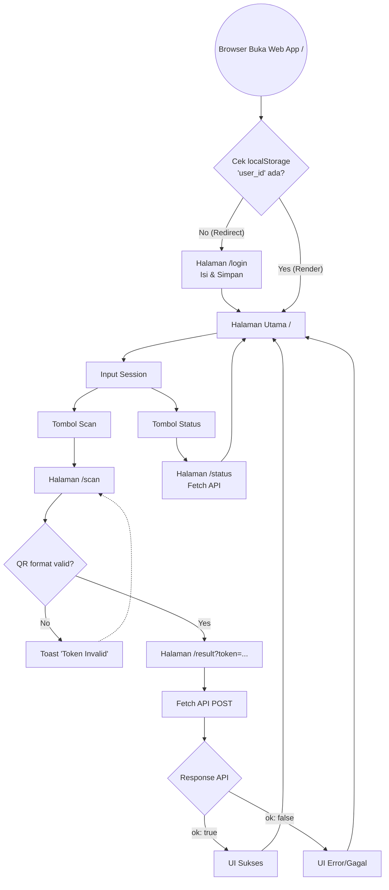

---

# Plan Next.js Web App — Modul 1: Presensi QR Dinamis

> Dokumen ini dibuat berdasarkan backend GAS yang sudah berjalan.
> Semua boundary dan requirement mengacu pada kontrak API aktual di `Code.gs`.
> Aplikasi didesain secara **Mobile-First** (tampilan menyerupai aplikasi mobile di browser).

---

## Ringkasan Aplikasi

Aplikasi Web (Next.js) untuk **mahasiswa** melakukan presensi dengan cara:

1. Scan QR Code yang ditampilkan dosen menggunakan kamera HP via browser.
2. Aplikasi mengirim check-in ke server GAS via API.
3. Mahasiswa dapat mengecek status presensinya sendiri.

---

## Batas Ruang Lingkup (Boundary)

### ✅ Yang ADA di Web App Next.js

* Input dan simpan identitas mahasiswa (`user_id`, `device_id`) secara lokal via `localStorage`
* Scan QR Code menggunakan kamera perangkat via browser API (WebRTC)
* Kirim check-in ke server via `fetch` API
* Tampilkan hasil check-in (sukses / gagal + pesan error spesifik)
* Cek status presensi sendiri berdasarkan `course_id` dan `session_id`
* Desain antarmuka responsif (Mobile-first menggunakan Tailwind CSS)

### ❌ Yang TIDAK ADA di Web App Next.js

* Generate QR Code → urusan Admin
* Lihat daftar mahasiswa lain yang hadir → urusan Admin
* Login/autentikasi berbasis akun (JWT/Session cookies) → identitas cukup input manual & simpan lokal
* Offline mode (meskipun bisa PWA, untuk v1 kita abaikan offline caching)
* Push notification

---

## Kontrak API yang Digunakan Next.js

Semua request menggunakan `POST` dengan `Content-Type: application/json`.
*Catatan Web: Pastikan backend GAS sudah mengonfigurasi header CORS (`Access-Control-Allow-Origin`) agar web client bisa menerima response dengan benar.*

### 1. Check-in

```http
POST {{BASE_URL}}/presence/checkin

```

**Request body (semua field WAJIB):**

```json
{
  "user_id":    "string — dari localStorage",
  "device_id":  "string — dari localStorage",
  "course_id":  "string — input user di form",
  "session_id": "string — input user di form",
  "qr_token":   "string — hasil scan QR (format: TKN-XXXXXX)",
  "ts":         "string — ISO-8601 UTC, contoh: 2026-02-24T10:01:00Z"
}

```

**Response sukses:**

```json
{ "ok": true, "data": { "presence_id": "PR-0001", "status": "checked_in" } }

```

**Response gagal (ok: false):**
| `error` value | Artinya | Pesan ke user |
|---------------|---------|---------------|
| `token_invalid` | Token tidak dikenal server | "QR Code tidak valid" |
| `token_expired` | Token sudah kedaluwarsa | "QR Code sudah kedaluwarsa, minta dosen refresh" |
| `already_checked_in` | User sudah check-in sesi ini | "Anda sudah melakukan presensi untuk sesi ini" |
| `missing_field: <x>` | Field tidak dikirim | "Terjadi kesalahan data, coba lagi" |
| `server_error: <x>` | Error di server | "Server error, coba beberapa saat lagi" |

### 2. Cek Status

```http
GET {{BASE_URL}}/presence/status?user_id=...&course_id=...&session_id=...

```

*(Query param wajib, response JSON sama seperti versi Flutter)*

---

## Struktur Proyek Next.js (App Router)

Menggunakan konvensi Next.js modern (`src/app`).

```text
src/
├── app/
│   ├── layout.tsx             ← Wrapper utama, setting meta tags (mobile viewport)
│   ├── page.tsx               ← HomeScreen (Menu utama)
│   ├── login/
│   │   └── page.tsx           ← LoginScreen (Input user_id & device_id)
│   ├── scan/
│   │   └── page.tsx           ← QrScanScreen (Kamera)
│   ├── result/
│   │   └── page.tsx           ← CheckinResultScreen (Hasil proses)
│   └── status/
│       └── page.tsx           ← StatusScreen (Cek presensi)
├── components/
│   ├── ui/                    ← Button, Input, Card (reusable)
│   ├── QrScanner.tsx          ← Komponen Web Scanner
│   └── ErrorAlert.tsx         ← Komponen notifikasi error
├── lib/
│   ├── constants.ts           ← BASE_URL
│   ├── api.ts                 ← Fungsi fetch ke GAS (checkIn, getStatus)
│   └── storage.ts             ← Helper untuk window.localStorage
└── types/
    └── presence.ts            ← TypeScript interfaces untuk Request/Response

```

---

## Spesifikasi Setiap Halaman (Pages)

### 1. Halaman Login (`/login`)

**Tujuan:** Input dan simpan `user_id` + `device_id` ke `localStorage`.

**Muncul saat:** User pertama kali buka web dan `localStorage.getItem('user_id')` kosong. (Bisa ditangani via `useEffect` di root layout/page yang me-redirect ke `/login`).

**Komponen UI:**

* Judul: "Selamat Datang"
* Input: **NIM / User ID**
* Input: **Device ID** (Bisa di-generate otomatis berupa UUID acak jika user malas isi, tapi tetap bisa diedit)
* Tombol: **"Simpan & Mulai"**

**Validasi & Action:**

* Tidak boleh kosong/spasi.
* Jika valid -> simpan ke `localStorage` -> `router.push('/')`.

---

### 2. Halaman Home (`/`)

**Tujuan:** Halaman utama navigasi.

**Komponen UI:**

* Header: Menyapa nama/NIM user.
* Form Input: **Course ID** & **Session ID** (Simpan state ini, atau auto-save ke `localStorage` setiap kali diubah).
* Tombol Besar: **"Scan QR Presensi"** → navigasi ke `/scan` membawa data course & session.
* Tombol outline: **"Cek Status Presensi"** → navigasi ke `/status`.

---

### 3. Halaman Scan QR (`/scan`)

**Tujuan:** Membaca QR Code dari kamera HP via browser.

**Komponen UI:**

* Viewfinder video stream (menggunakan library seperti `html5-qrcode` atau `@yudiel/react-qr-scanner`).
* Teks panduan: "Arahkan kamera ke QR Code di layar".
* Tombol: **"Batal"** (`router.back()`).

**Logika scan:**

1. Minta izin kamera (Browser akan memunculkan popup *Allow Camera*).
2. Jika terdeteksi QR → **pause scanner**.
3. Validasi awalan string `TKN-`. Jika salah, tampilkan Toast error, resume scanner.
4. Jika valid → redirect ke `/result?token=TKN-XXXXXX`.

**Boundary Web:**

* **Penting:** Akses kamera di web (`getUserMedia`) **WAJIB menggunakan HTTPS** (kecuali `localhost` saat development).
* Jika user me-reject izin kamera, tampilkan instruksi cara membuka blokir di setting browser.

---

### 4. Halaman Hasil Check-in (`/result`)

**Tujuan:** Melakukan request `POST` ke server dan menampilkan hasil.

**Muncul saat:** Redirect dari `/scan` membawa parameter URL `?token=...`

**Alur Kerja (di dalam `useEffect`):**

1. Ambil token dari parameter URL.
2. Ambil `user_id`, `device_id`, `last_course_id`, `last_session_id` dari `localStorage`.
3. Tampilkan UI **Loading Spinner**.
4. Panggil `fetch` ke API GAS.
5. Update UI berdasarkan hasil (Sukses ✅ atau Gagal ❌ sesuai tabel mapping error).

**Komponen UI (Gagal):**

* Pesan spesifik.
* Tombol: **"Scan Ulang"** (`router.replace('/scan')`).

---

### 5. Halaman Status (`/status`)

**Tujuan:** Cek status presensi.

**Komponen UI:**

* Form input **Course ID** dan **Session ID** (Pre-fill dari `localStorage`).
* Tombol: **"Cek Status"** (Trigger `GET` request).
* Area Hasil: Render komponen Badge ("✓ HADIR" hijau atau "✗ BELUM HADIR" abu-abu).

---

## Dependencies `package.json`

Gunakan framework dan library modern:

```bash
npx create-next-app@latest presensi-qr --typescript --tailwind --eslint --app

```

**Library tambahan yang direkomendasikan:**

```bash
# Untuk scan QR di browser
npm install @yudiel/react-qr-scanner 
# ATAU html5-qrcode

# Untuk icons
npm install lucide-react

# Untuk notifikasi pop-up (Toast)
npm install react-hot-toast

```

---

## `localStorage` — Keys yang Dipakai

| Key | Tipe | Diisi di | Dipakai di |
| --- | --- | --- | --- |
| `user_id` | String | `/login` | `/result`, `/status` |
| `device_id` | String | `/login` | `/result` |
| `last_course_id` | String | `/` (Home) atau `/status` | `/result`, `/status` |
| `last_session_id` | String | `/` (Home) atau `/status` | `/result`, `/status` |

---

## Alur Navigasi Lengkap (Web)



---

## Catatan Penting untuk Lingkungan Web

1. **CORS (Cross-Origin Resource Sharing):** Karena web app berjalan di domain yang berbeda (misal Vercel) dari GAS (`script.google.com`), pastikan script `Code.gs` merespon request `OPTIONS` dengan benar. GAS sering mengalami masalah dengan CORS jika mengirim payload JSON langsung. Pendekatan aman: pastikan backend mem-bypass ini atau menggunakan header `text/plain` jika `application/json` diblokir preflight.
2. **HTTPS & Kamera:** Untuk mendeploy ini, Anda WAJIB menggunakan hosting ber-HTTPS (seperti Vercel, Netlify, atau GitHub Pages). Browser memblokir akses `navigator.mediaDevices` pada koneksi HTTP biasa.
3. **PWA (Opsional tapi disarankan):** Tambahkan `manifest.json` agar mahasiswa bisa "Add to Home Screen" dan menggunakannya layaknya aplikasi native.

---
